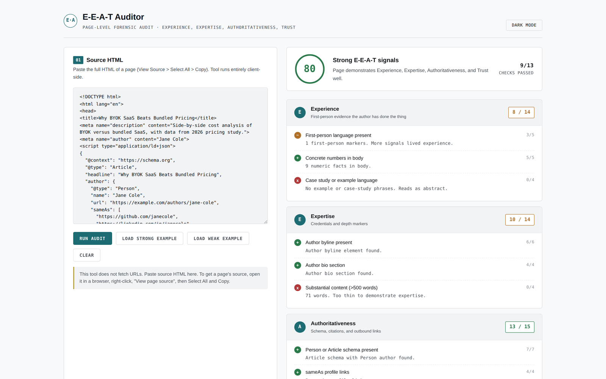

# e-e-a-t-auditor

Audit any web page's HTML for E-E-A-T signals: Experience, Expertise, Authoritativeness, Trust. Browser-only.

**Live demo:** https://0xelitesystem.github.io/e-e-a-t-auditor/

## What it does

Paste a page's HTML source. Get a 0-100 score broken down across the four E-E-A-T dimensions, with thirteen specific checks scored individually. Updates on demand.

## The four dimensions

| Dimension | What it measures |
|---|---|
| Experience | First-person language, concrete numbers, case-study phrases |
| Expertise | Author byline, author bio, content depth |
| Authoritativeness | Person/Article schema, sameAs profiles, outbound citations |
| Trust | datePublished, dateModified, contact info, publisher |

## The thirteen checks

**Experience**
- First-person language present (5 pts)
- Concrete numbers in body (5 pts)
- Case study or example language (4 pts)

**Expertise**
- Author byline present (6 pts)
- Author bio section (4 pts)
- Substantial content over 500 words (4 pts)

**Authoritativeness**
- Person or Article schema present (7 pts)
- sameAs profile links in schema (4 pts)
- Outbound citation links (4 pts)

**Trust**
- datePublished in schema or visible time element (6 pts)
- dateModified for freshness (3 pts)
- Contact info or contact link (4 pts)
- Publisher organization in schema (4 pts)

Total: 60 points possible, normalized to a 0-100 score.

## Use it

Open `index.html` in any browser. Or visit `https://0xelitesystem.github.io/e-e-a-t-auditor/`.

1. Open any page in your browser.
2. Right-click and select "View page source".
3. Select All, Copy.
4. Paste into the textarea, click "Run audit".
5. Read the dimension breakdown and fix the failing checks.

Try the strong example and weak example buttons to see the contrast.

## What it does NOT do

- Does not fetch URLs. CORS blocks browser-side fetching of arbitrary pages. Paste source HTML.
- Does not check factual accuracy. A wrong page with good signals scores high.
- Does not check links or images load. Schema validation only.
- Does not run JavaScript. If your page renders the byline client-side, source-view will not show it; use the rendered HTML from DevTools instead.

## How this differs from the other tools

- [ai-citability-scorer](https://github.com/0xelitesystem/ai-citability-scorer) scores a single paragraph for AI citation likelihood.
- [readme-slop-checker](https://github.com/0xelitesystem/readme-slop-checker) scans README files specifically for AI-generated slop patterns.
- **e-e-a-t-auditor scores the whole page** for the trust signals AI engines and Google use.

All three together cover passage > document > README.

## What's not included

- No localStorage. Refresh clears your input.
- No backend, no analytics, no third-party scripts.

## Pairs with

- [ai-citability-scorer](https://github.com/0xelitesystem/ai-citability-scorer): score one paragraph at a time
- [schema-markup-generator](https://github.com/0xelitesystem/schema-markup-generator): generate the schema this auditor checks for
- [llms-txt-generator](https://github.com/0xelitesystem/llms-txt-generator): help AI engines find your strong pages first
- [geo-audit-checklist](https://github.com/0xelitesystem/geo-audit-checklist): full GEO checklist with E-E-A-T as one section

## More

Part of a catalog of single-file browser tools and plain-language references, all MIT licensed and dependency-free: [0xelitesystem.github.io](https://0xelitesystem.github.io/). Built by [elitesystem.ai](https://elitesystem.ai).

## License

MIT. Free to use, fork, modify, and ship.
